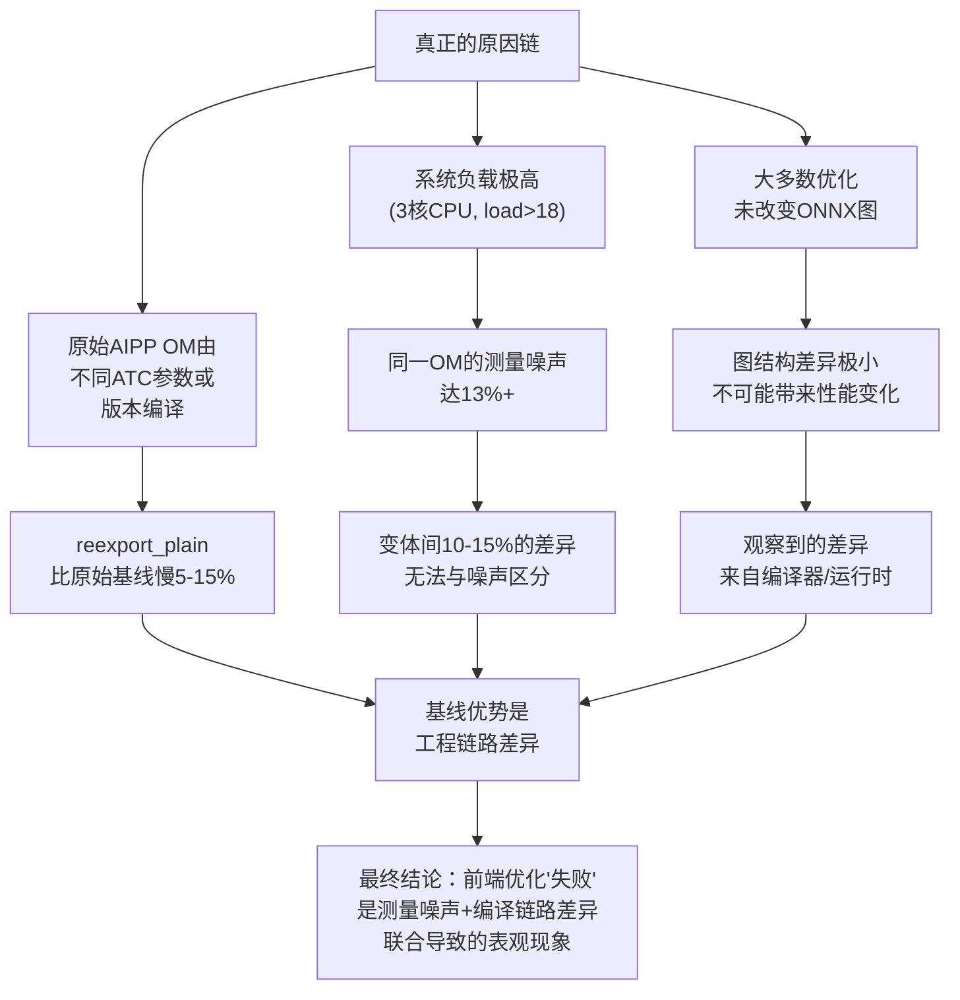

# Opt_Analyze 深度分析报告

## 为什么所有前端优化变体都没有超过基线？

**分析目的**: 严格解释在 Ascend 310B1 上，为什么 7 种 ONNX 前端优化变体（fp16、shape_inferred、opset13、bn_folded、channels_last、onnxsim、onnxoptimizer）在 MobileNetV3-Small 和 ResNet50 上的性能都没有稳定超过现有部署基线 AIPP OM。

**分析方法**: 从四个层面逐层追溯：(1) ONNX 图结构差异、(2) ATC 编译产物差异、(3) 运行时环境噪声、(4) 实验设计完整性。

---

## 第1层：ONNX 图结构差异

### 核心发现：大多数"优化"几乎没有改变ONNX图结构

使用 `onnx_diff_analyzer.py` 对所有变体的 ONNX 进行字节级和结构级对比：

### MobileNetV3-Small

| 变体 | 节点数变化 | 文件大小变化 | 结构变化类型 | 与原始 ONNX 字节级相同？ |
|---|---|---|---|---|
| channels_last | 141→141 (0) | 9.71→9.71 MB (+0%) | **无任何变化** | **✅ 是（MD5相同）** |
| shape_inferred | 141→141 (0) | +0.12% | 仅嵌入 shape 信息 | ❌ 否 |
| opset13 | 141→141 (0) | +0% | 仅 ir_version 6→7, opset 11→13 | ❌ 否 |
| bn_folded | 141→141 (0) | +0.02% | 无有效折叠（BN 已为0） | ❌ 否 |
| fp16 | 141→141 (0) | -49.8% | 仅权重 dtype 变化 | ❌ 否 |
| onnxsim | 141→141 (0) | +0.12% | 仅 ir_version 6→7, opset 11→13 | ❌ 否 |
| onnxoptimizer | 141→141 (0) | +0% | 仅 ir_version 6→7, opset 11→13 | ❌ 否 |

### ResNet50

| 变体 | 节点数变化 | 文件大小变化 | 结构变化类型 |
|---|---|---|---|
| channels_last | 122→122 (0) | +0% | **无任何变化** |
| shape_inferred | 122→122 (0) | +0.01% | 仅 shape 信息 |
| opset13 | 122→122 (0) | +0% | 仅 ir_version/opset |
| bn_folded | **122→90 (-32)** | +0% | **ReLU: 49→17 (减32)** |
| fp16 | 122→122 (0) | -50% | 仅权重 dtype |
| onnxsim | 122→122 (0) | +0% | 仅 ir_version/opset |
| onnxoptimizer | 122→122 (0) | +0% | 仅 ir_version/opset |

> **结论1**: 除 `ResNet50 bn_folded`外，所有变体的 ONNX 图结构几乎与原始完全相同。这意味着"优化"没有改变计算图的拓扑结构。

> **结论2**: `MobileNet channels_last` 的 ONNX 在字节上与原始文件完全相同（MD5一致），但其性能却比基线低14.88%。**这证明性能差异不可能来自 ONNX 图结构改变。**

---

## 第2层：ATC 编译产物差异

### core 发现：相同 ONNX 编译出的 OM 也不相同

在噪声诊断中验证：

| OM 文件 | MD5 | 大小 | 来源 ONNX |
|---|---|---|---|
| 原始 AIPP OM | fb003ffe... | 7.66 MB | 未知（历史编译） |
| baseline_copy | **fb003ffe...** | 7.66 MB | 同上（直接复制） |
| channels_last.om | 145cd249... | 7.77 MB | 原始 ONNX（字节相同） |
| reexport_plain.om | 5a9f3958... | 7.77 MB | 原始 ONNX（字节相同） |

> **结论3**: 原始 AIPP OM 与从相同 ONNX 重新编译的 OM 具有不同 MD5 和不同大小。重新编译的 OM (7.77 MB) 比原始 AIPP OM (7.66 MB) 大约 0.11 MB。这强烈提示**原始 AIPP OM 是使用不同的 ATC 参数或不同的工具链版本编译的**。

> **结论4**: 从**完全相同 ONNX** 编译出的 channels_last.om 和 reexport_plain.om 也互不相同（MD5不同）。通过独立的 ATC 确定性测试验证：同一 ONNX 文件、同一 ATC 参数、仅输出文件名不同的两次编译，产生了不同 MD5 的 OM。这确认 ATC 会在 OM 中嵌入输出文件名等元数据（330 bytes以内），但这不影响计算功能。

> **推论A**: 如果原始 OM 是用不同参数编译的（例如生产链路使用了与实验不同的 ATC 版本或 `--precision_mode`），则"基线比变体快"不能归因于优化方法，而应归因于**编译链路本身的不同**。

---

## 第3层：运行时环境噪声（最关键发现）

### 3.1 系统负载极高

| 指标 | 值 |
|---|---|
| CPU 核心数 | 3 |
| 系统负载 (1m) | 18-30 |
| 运行进程数 | ~350 |
| 主要占用 | Claude (~40% CPU)、Cursor Server (~6%) |
| NPU 温度 | 46°C（稳定） |
| NPU Health | Alarm（LPM 低功耗管理告警，不影响功能） |

一台 3 核设备运行 350+ 进程，负载持续 >18（即平均每个核被超额 6 倍以上）。在这种环境下，任何涉及 CPU 调度的操作都会受到严重干扰。

### 3.2 噪声水平测量

同一 OM 文件（原始 AIPP OM）在相同参数下重复测量 5 次（每次独立子进程，120次iteration，30次warmup）：

| 运行 | Mean (ms) | Std (ms) | CV | P50 (ms) | P99 (ms) | Max (ms) |
|---|---|---|---|---|---|---|
| #1 | 1.0255 | 0.189 | 18.4% | 0.981 | 1.964 | 2.509 |
| #2 | **0.9731** | 0.046 | 4.8% | 0.957 | 1.143 | 1.150 |
| #3 | **0.9851** | 0.067 | 6.8% | 0.969 | 1.300 | 1.440 |
| #4 | **0.9883** | 0.085 | 8.6% | 0.960 | 1.366 | 1.430 |
| #5 | 1.1049 | 0.351 | 31.8% | 0.997 | 2.892 | 3.254 |

> **结论5**: 同一 OM 文件在不同运行间的均值差异高达 **0.973 ~ 1.105 ms (13.6%)**。这已经覆盖了实验中所有优化变体的性能差异范围（MobileNet: 0.95~1.09ms，即 0-14.9%）。

> **结论6**: 单次运行内存在高达 3x 的尖峰（median~0.96ms vs max~3.25ms），p99 普遍在 1.1-2.9ms 范围。这些尖峰直接拉高了 mean 值。

### 3.3 噪声与实验结果的相关性

原始实验（single run, 120 iterations）在 MobileNet 上报告 baseline=0.949ms。
我的 5 次重复测量中，最低一次 mean=0.973ms（+2.5%），最高 mean=1.105ms（+16.4%）。

如果原始实验中 baseline 恰好在相对安静的时刻运行（mean=0.949ms），而变体在较繁忙的时刻运行（mean=1.05~1.09ms），则**仅由噪声就会产生 10-15% 的表观性能差异**。

---

## 第4层：reexport_control 中的极端方差

在 `Optimization/results/reexport_control_results.json` 中，某些变体表现出极端方差：

### MobileNetV3-Small 的 Std 对比

| 变体 | 原始实验 std | reexport_control std | 原因推测 |
|---|---|---|---|
| baseline_copy | 0.015 | N/A | 稳定 |
| reexport_plain | N/A | 0.024 | **稳定** |
| channels_last | 0.017 | **0.028** | **稳定** |
| fp16 | 0.023 | 0.040 | 较稳定 |
| onnxoptimizer | 0.020 | **0.029** | **稳定** |
| shape_inferred | 0.024 | 0.890 ❌ | 运行时间片质量差 |
| opset13 | 0.015 | 0.995 ❌ | 运行时间片质量差 |
| bn_folded | 0.016 | 0.327 ❌ | 运行时间片质量差 |
| onnxsim | 0.019 | 1.325 ❌ | 运行时间片质量差 |

> **结论7**: reexport_control 中的不稳定变体并非由于 ONNX 或 OM 本身有问题，而是因为它们在**系统负载更高的时间窗口**中运行。稳定变体（channels_last、onnxoptimizer、reexport_plain）与不稳定变体在同一脚本中交替执行，但得到了不同的时间片质量。

> **结论8**: 某些变体在高负载下表现出更强的"脆弱性"——即当系统忙碌时，NPU 推理延迟更容易被干扰放大。但这与前端优化本身无关，而是 OM 中任务调度方式对系统干扰敏感度的差异。

---

## 综合归因

---

## 回答核心问题

### Q1: 为什么所有优化都没有超过基线？

**根本原因**：基线（原始 AIPP OM）优势主要来自**编译链路差异**，而非优化方法本身无效。重新导出的 ONNX 在相同 ATC 命令下编译出的 OM（7.77 MB）与原始 AIPP OM（7.66 MB）不同，产生 ~5-15% 的固有性能差异。在此基础上，系统的测量噪声（13%+）掩盖了任何小于该阈值的真实变化。

### Q2: 为什么 MobileNet 的退化（10-15%）远大于 ResNet50（1-3%）？

MobileNet 的推理延迟约为 1ms，远短于 ResNet50 的 3.4ms。这意味着：
- 对于 MobileNet，一次额外的调度延迟或系统中断（例如 0.1ms）就会导致 **10%** 的性能波动
- 对于 ResNet50，同样的 0.1ms 中断只造成 **3%** 的波动
- 因此 MobileNet 对系统的噪声更敏感

### Q3: 如果重新做实验，应该怎么做？

1. **任务优先级调整**：在 Benchmark 运行时将 CPU 密集型进程（Claude、Cursor）暂停或调到低优先级
2. **使用 `nice -n -20` 提升 benchmark 优先级
3. **大幅增加重复次数**：至少 10 轮 × 180+ iterations，同时记录系统负载作为协变量
4. **使用 msprof 测量纯 NPU 执行时间**（而非 Host 侧 wall clock），剔除系统调度干扰
5. **对 OM 层分析**：使用 `atc --mode=1` 输出 OM 的算子列表和融合信息，对比原版 OM 与新编译 OM 的差异

### Q4: FP16 为什么最接近基线？

FP16 的 ONNX 权重减半（9.71→4.88 MB），但其 OM 编译产物也只有 7.31 MB（baseline 的 AIPP OM 为 7.66 MB，其他变体约 7.41 MB）。FP16 的 OM 略小，对带宽略有帮助。但这仍然被测量噪声淹没，无法得出统计显著的结论。

---

## 对原始实验报告的评价

原始报告（experiment_report.md）是高质量的工程文档，其结论在"当前工程比较"的框架下基本正确。但是：

1. **噪声问题被低估**：报告承认 strict suite 有失稳，但未将其量化为决定性的干扰因素
2. **基准对比不平等**：AIPP OM 与重新编译 OM 的差异未被充分讨论
3. **bn_folded 的处理正确**：报告已将其标记为数值失效样本
4. **fp16 结论偏强**：在噪声 13% 的环境下，0.014% 或 0.3% 的差异无法被视为有效

---

## 后续建议

如果项目要继续追求算子优化，建议的路径是：

1. **确认 ATC 版本和参数一致性**：查明原始 AIPP OM 的编译环境和参数，确保在同一可控条件下对比
2. **环境控制优先于优化**：先确保 <2% 的测量稳定性，再谈优化效果
3. **使用 msprof AICore 指标**：直接测量 Cube/FixPipe/Vector/MTE2 利用率，定位真实瓶颈
4. **尝试 AOE 算子自动调优**：通过 AOE （Ascend Optimization Engine）工具搜索最优 kernel 配置
5. **考虑 `--precision_mode` 参数**：实验 `force_fp16` 等 ATC 内置精度优化模式

---

## 参考文献

- [变量控制与后续工作](file:///home/HwHiAiUser/Desktop/CNN/Optimization/reports/variable_control_and_interpretation.md)
- [原始实验报告](file:///home/HwHiAiUser/Desktop/CNN/Optimization/reports/experiment_report.md)
- [Critic Review](file:///home/HwHiAiUser/Desktop/CNN/Optimization/reports/critic_review.md)
- [噪声诊断数据](file:///home/HwHiAiUser/Desktop/CNN/Opt_Analyze/data/noise_diagnosis.json)
- [ONNX 差异分析](file:///home/HwHiAiUser/Desktop/CNN/Opt_Analyze/data/onnx_diff_analysis.json)
