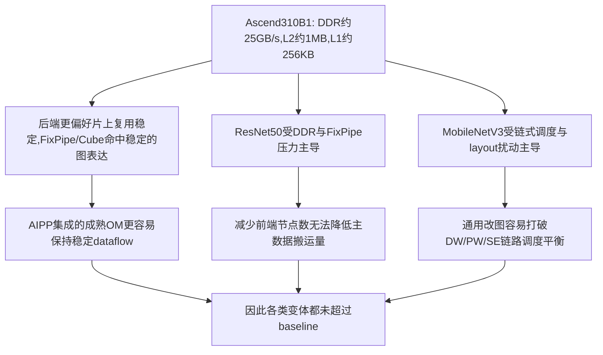

# Ascend 310B1 CNN 算子融合与优化实验报告

## 1. 实验目标与范围

本阶段围绕已经完成部署与测量的两类 CNN 模型开展系统化优化实验：

- `ResNet50`：普通卷积 + 残差瓶颈块主导
- `MobileNetV3-Small`：深度可分离卷积 + SE + 短残差主导

实验目标分为四部分：

1. 梳理当前基线模型的结构特点与可能已经具备的融合特征。
2. 对常见前端优化方法逐项构造可复现实验变体。
3. 在统一的 ATC 编译参数与统一 benchmark 条件下测量每个变体的实际推理性能。
4. 解释为什么这些优化没有超过现有基线，并分析基线为何仍然最优。

本轮实验保留了所有实验相关脚本、原始结果、图统计、导出模型与编译模型，统一存放在 `Optimization/` 目录。

## 2. 实验对象与基线定义

### 2.1 基线不是“原始 ONNX”，而是“已部署 AIPP OM”

本实验的性能基线并不是直接拿 `torchvision` 导出的 ONNX 再即时编译，而是项目中已经存在、已部署并可直接运行的 AIPP OM：

- MobileNetV3-Small 基线：`MobileNet/mobilenetv3_aipp.om`
- ResNet50 基线：`ResNet/resnet50_aipp.om`

自动化实验中使用 `baseline_copy` 将上述现有 OM 复制到 `Optimization/models/` 下重新测量，以确保所有结果都在同一套隔离 benchmark 流程中得到。

### 2.2 基线结构与对照边界的关键信息

从当前实验数据可以确认：

1. **基线走的是 AIPP + OM 的成熟部署链路**  
   编译阶段统一带有 `--insert_op_conf=<model_dir>/aipp.cfg`，说明输入预处理已经下沉到 Ascend 侧 AIPP，而不是在 Python/CPU 侧单独做。这通常会减少主机侧预处理开销，也能让编译器围绕真实输入格式做更稳定的图与数据流安排。

2. **基线并非“未经优化”的原始版本**  
   实验使用的优化变体大多来自 `torchvision` 权重重新导出，再交给 ATC 编译；而基线是项目原有、已经用于部署的 OM。它很可能已经经过更适合当前工程链路的导出、AIPP 配置和编译设置，因此本轮实验实际上是在挑战一个已经较强的生产基线。

3. **当前结论更适合被理解为“工程对比”，而非纯净单变量对照**  
   由于基线与重新导出变体并不共享完全相同的上游来源与导出形成路径，本报告可以严谨回答“当前工程里谁跑得更快”，但不能把结果直接上升为“某种前端优化方法本身在该平台必然无效”。

4. **当前缺少 `reexport_plain` 一类的中性对照组，但已补做一轮更干净的顺序控制复测**  
   也就是说，本轮还没有构造“同样来自 `torchvision`、同样走相同编译流程、但不启用额外优化”的普通重导出版本，因此仍不能把“优化方法本身的作用”与“重新导出链路整体差异”完全分离。  
   不过，本次补充实验新增了一轮 `ABAB` 交错 strict suite（`baseline1 -> fp16_1 -> baseline2 -> fp16_2`），用于减少原先 `A-B-B-A` 顺序设计带来的边界偏差。

5. **基线对应的上游 ONNX 已经高度“预融合”**  
   无论是 `ResNet50` 还是 `MobileNetV3-Small`，当前 ONNX 图统计中都已不存在显式 `BatchNormalization` 节点，说明导出阶段已经吸收了大部分 Conv-BN 结构。也就是说，本轮很多“前端优化”并不是在一个很粗糙的初始图上继续精简，而是在一个已经较干净的导出图上继续改写。

## 3. 两类模型的结构特征与融合形态

### 3.1 ResNet50：规则块结构，编译器容易识别

结构分析结果：

- 总卷积层数：53
- BottleNeck 数：16
- 主导融合模式：`Conv+BN+ReLU`、`Conv+BN+Add+ReLU`、`Downsample Conv+BN`
- 融合密度指标：1.00

这说明 ResNet50 的计算图重复度高、块结构稳定，适合编译器在块级别进行模式匹配与融合。它的优化重点通常不是“图太乱”，而是：

- 3x3 标准卷积的大特征图读写
- 残差分支同步与逐元素 Add
- 访存与流水利用率平衡

### 3.2 MobileNetV3-Small：链路更碎，更依赖调度

结构分析结果：

- 总卷积层数：34
- Depthwise 卷积层数：11
- Pointwise 卷积层数：21
- SE 模块数：9
- 主导融合模式：`PW(expand)+BN+Act`、`DWConv+BN+Act`、`SE scale`、`PW(project)+Add`
- 融合密度指标：1.44

这说明 MobileNetV3 的性能并不单纯取决于“有没有把几个节点融合掉”，而更依赖：

- DW / PW / SE 连续链路的调度方式
- 中间张量驻留与复用
- 小算子切换成本
- layout 与访存模式是否适合当前后端

换句话说，这类网络对“图节点数量减少”并不一定敏感，但对底层 kernel 调度更敏感。

## 4. 本轮测试的优化方式与实现细节

本轮所有优化都围绕 `torchvision` 模型重新导出 ONNX，并在统一参数下重新编译为 `.om`，然后进行隔离 benchmark。

为了更白话地理解，可以把这轮实验想成：**我们没有去改 Ascend 推理程序本身，而是在“模型导出成 ONNX 之前 / 之后”分别动一些手脚，再看最后编译出来的 OM 跑得是更快还是更慢。**

### 4.1 `baseline_copy`

**白话理解**：这不是新优化，而是把项目里现在正在用、已经部署好的那个基线模型原样拿过来，重新跑一遍统一测试。  
**具体做法**：直接复制当前已部署 AIPP OM，作为统一 benchmark 的参考基线。  
**你可以把它理解成**：先把“现在最能打的正式选手”请上场，后面所有变体都拿它做参照。  
**目的**：避免把历史手工测试数据与本轮自动化结果混用。  
**意义**：它代表“当前工程中实际可用的最好版本”。

### 4.2 `shape_inferred`

**白话理解**：不改网络结构，不改权重，只是把 ONNX 图里每个张量的形状信息补得更完整一些。  
**具体做法**：对原始 ONNX 执行 shape inference，补全静态 shape 信息，再送入 ATC 编译。  
**你可以把它理解成**：给编译器一张“标注更清楚的施工图”，看它会不会因此更容易做优化。  
**理论动机**：更完整的静态维度信息有时能帮助后端做更激进的图推理、内存规划与算子选择。  
**实际结果特征**：图节点数基本不变，属于“给编译器更多信息”的轻量前处理，而不是显式改图。

### 4.3 `opset13`

**白话理解**：不改模型干的事情，只是换一种 ONNX 的“写法版本”。  
**具体做法**：将模型重新导出为 ONNX opset 13。  
**你可以把它理解成**：同一句话，意思不变，但换一套语法写给编译器看，看看它会不会更容易读懂。  
**理论动机**：不同 opset 对同一语义的表达方式可能不同，进而影响 ATC 的模式匹配与融合命中。  
**实际结果特征**：两类模型的图节点统计几乎未变，说明仅切换 opset 并未改变核心结构表达。

### 4.4 `bn_folded`

**白话理解**：提前把一些本来连着出现的层“揉成一层”再导出。这里主要是把 `Conv + BN` 这类组合，尽量在 PyTorch 侧先合并掉。  
**具体做法**：在 PyTorch 侧用 `fuse_modules` 显式做 Conv/Linear 与 BN 融合，再导出 ONNX。  
**你可以把它理解成**：不是等后端编译器自己去猜哪里能融合，而是我们先帮它把一部分步骤合起来。  
**理论动机**：提前消除 BN，减少节点数和运行时访存，帮助后端拿到更紧凑的图。  
**实际结果特征**：

- 对 ResNet50：图节点数显著下降
- 对 MobileNetV3：几乎无变化

这说明 MobileNetV3 在现有导出链路里原本就已经没有多少显式 BN 可折叠了，而 ResNet50 仍然可以通过这种预处理让图表达进一步收缩。  
不过需要注意：`ResNet50 bn_folded` 后来被数值验证发现有严重失真，所以它只能说明“我们确实这样做过”，不能说明“这样做就是有效优化”。

### 4.5 `channels_last`

**白话理解**：不是改网络层，而是尝试改变模型在导出时默认采用的内存排布痕迹。  
**具体做法**：以 `channels_last` 内存格式构造模型与 dummy input 后导出 ONNX。  
**你可以把它理解成**：我们想试试看，换一种更偏“通道放后面”的内部摆放方式导出，后端会不会更喜欢。  
**理论动机**：尝试让编译器拿到更贴近某些后端布局优化偏好的图表示，减少潜在布局变换。  
**实际结果特征**：图节点计数不变，说明这类优化是否有效，主要取决于后端是否真的按照该导出痕迹生成了更优 kernel / dataflow。

### 4.6 `fp16`

**白话理解**：把模型里的参数从 32 位浮点数换成 16 位浮点数，再导出和编译。  
**具体做法**：将模型权重转为半精度后导出 ONNX，再编译为 OM。  
**你可以把它理解成**：让模型“瘦身”，看看更轻的参数能不能减少带宽压力、提升运行速度。  
**理论动机**：减少模型体积与带宽压力，可能改善缓存命中和数据搬运成本。  
**实际结果特征**：ONNX 体积约减半，但运行性能提升非常有限，仅接近基线，未稳定超过基线。

### 4.7 `onnxsim`

**白话理解**：把已经导出的 ONNX 再拿去“做一次整理”，删掉一些没必要的绕路表达。  
**具体做法**：对导出的 ONNX 执行 `onnxsim` 简化，做常量折叠与冗余节点清理。  
**你可以把它理解成**：像给电路图做清稿，把多余线头和没必要的中间步骤擦掉。  
**理论动机**：减少图冗余，提高编译器识别能力。  
**实际结果特征**：在本轮两类模型上，图主结构基本不变，说明原始导出图已经比较干净，可进一步消除的冗余很少。

### 4.8 `onnxoptimizer`

**白话理解**：和 `onnxsim` 类似，也是对 ONNX 图再做一轮通用整理，但它更像“跑一组标准优化规则”。  
**具体做法**：使用 `onnxoptimizer` 执行一组常见 pass，例如：

- `eliminate_identity`
- `eliminate_deadend`
- `eliminate_unused_initializer`
- `fuse_bn_into_conv`
- `fuse_consecutive_transposes`

**你可以把它理解成**：给 ONNX 图套一遍“常规体检 + 常规清理流程”，看看能不能自动修整出更适合编译的形式。  
**理论动机**：通过常见 ONNX 图重写进一步缩短图路径。  
**实际结果特征**：对最终性能没有带来提升，说明这些 pass 并没有改写出更适合当前 Ascend 编译链路的表达形式。

## 5. 图结构与模型体积结果

### 5.1 ResNet50 图结构变化

原始 / 参考导出图统计：

- 节点数：122
- Conv：53
- ReLU：49
- Add：16
- BatchNorm：0
- 模型体积：97.41 MB

`bn_folded` 后：

- 节点数：90
- 节点减少：32（26.2%）
- ReLU：49 → 17
- 模型体积：97.41 MB → 97.41 MB

`fp16` 后：

- 模型体积：48.72 MB

结论：ResNet50 的显式 BN folding 的确显著收缩了前端图结构，但这并没有转化为端到端推理加速。

### 5.2 MobileNetV3-Small 图结构变化

原始 / 参考导出图统计：

- 节点数：141
- Conv：52
- HardSigmoid：28
- Mul：28
- Add：6
- BatchNorm：0
- 模型体积：9.71 MB

`bn_folded` 后：

- 节点数：141
- 节点变化：0
- 模型体积：9.71 MB → 9.72 MB

`fp16` 后：

- 模型体积：4.88 MB

结论：MobileNetV3-Small 当前导出图已经处于较高的预融合状态，BN folding 基本没有额外操作空间。

## 6. 统一 benchmark 结果汇总

下面所有性能数据都来自同一轮自动化实验，在独立进程 benchmark、统一 warmup 与 iteration 条件下得到，因此可直接横向比较。需要特别说明的是：第 6.1 / 6.2 节中的大表展示的是**当前工程基线 vs 各变体**的整体工程结果，其数据源是 `experiment_summary.json`；第 6.3 节的 strict 复测只用于更谨慎地回答“baseline 与 fp16 是否存在稳定差异”，不应回填覆盖第 6.1 / 6.2 节的大表。另一个重要边界是：数值正确性并未对所有变体完全闭环，因此表中的性能排序不等同于“全部都是可直接进入最终候选集的有效模型”。

### 6.1 MobileNetV3-Small 性能结果

| 变体 | 延迟 ms | FPS | 相对基线延迟变化 | 相对基线 FPS 变化 | 结论 |
| --- | ---: | ---: | ---: | ---: | --- |
| baseline_copy | 0.9493 | 1053.38 | 0.00% | 0.00% | 当前工程基线 |
| fp16 | 0.9671 | 1034.06 | +1.87% | -1.83% | 最接近基线 |
| bn_folded | 1.0604 | 943.03 | +11.70% | -10.48% | 正确但变慢 |
| shape_inferred | 1.0671 | 937.16 | +12.40% | -11.03% | 正确但变慢 |
| opset13 | 1.0822 | 924.03 | +13.00% | -12.28% | 正确但变慢 |
| onnxoptimizer | 1.0839 | 922.58 | +13.62% | -12.41% | 正确但变慢 |
| onnxsim | 1.0872 | 919.78 | +14.53% | -12.68% | 正确但变慢 |
| channels_last | 1.0906 | 916.94 | +14.88% | -12.95% | 正确但最差 |

### 6.2 ResNet50 性能结果

| 变体 | 延迟 ms | FPS | 相对基线延迟变化 | 相对基线 FPS 变化 | 结论 |
| --- | ---: | ---: | ---: | ---: | --- |
| baseline_copy | 3.3465 | 298.82 | 0.00% | 0.00% | 当前工程基线 |
| fp16 | 3.3784 | 296.00 | +0.95% | -0.94% | 最接近基线，但正确性未闭环 |
| shape_inferred | 3.3958 | 294.48 | +1.47% | -1.45% | 正确但略慢 |
| opset13 | 3.4015 | 293.99 | +1.64% | -1.62% | 正确但略慢 |
| channels_last | 3.4059 | 293.61 | +1.77% | -1.74% | 正确但略慢 |
| onnxoptimizer | 3.4059 | 293.61 | +1.77% | -1.74% | 正确但略慢 |
| onnxsim | 3.4160 | 292.74 | +2.08% | -2.03% | 正确但变慢 |
| bn_folded | 3.4405 | 290.65 | +2.81% | -2.73% | 数值失真，不能作为有效性能样本 |

### 6.3 严格复测：baseline vs fp16

为进一步验证 `fp16` 是否只是“偶然接近基线”，本轮补充了两组严格复测：

- 原始 strict suite：`A-B-B-A` 交错顺序，即 `2 次 baseline + 2 次 fp16`，每次 `3 rounds × 220 iterations`
- 新增 strict suite：`A-B-A-B` 交错顺序，即 `baseline1 -> fp16_1 -> baseline2 -> fp16_2`，每次同样为 `3 rounds × 220 iterations`
- 单模型严格 benchmark：`3 rounds × 180 iterations`
- 每轮之间加入 cooldown，降低温度与前序运行顺序对结果的影响

需要强调的是：新增 `A-B-A-B` 复测并没有从根本上消除环境波动，但它至少去除了原始 `A-B-B-A` 设计中“中间两次连续运行同一变体”的明显顺序偏差，因此可以作为更干净的辅助证据。

#### MobileNetV3-Small 严格复测汇总

| 对比项 | A-B-B-A | A-B-A-B | 说明 |
| --- | ---: | ---: | --- |
| baseline 平均延迟 (ms) | 0.96048 | 0.96130 | 两轮设计结果接近 |
| fp16 平均延迟 (ms) | 0.96034 | 0.96171 | 两轮设计结果接近 |
| fp16 相对 baseline 变化 | -0.014% | +0.043% | 都处于近似持平范围 |
| 单模型严格 benchmark (ms) | baseline = 1.9412；fp16 = 3.5465* | — | 单跑明显失稳，不能作为最终判定依据 |

\* 单模型严格 benchmark 中，MobileNetV3-Small baseline 为 `1.9412 ms`、fp16 为 `3.5465 ms`，二者都明显偏离交错 strict suite 中约 `0.96 ms` 的量级，其中 fp16 偏移尤其严重。这说明单独长跑场景受到运行状态或测试条件差异影响较大。因此本报告在判断 `fp16` 是否优于基线时，更依赖交错 strict suite 的成对复测结果，而不是单模型长跑结果。

#### ResNet50 严格复测汇总

| 对比项 | A-B-B-A | A-B-A-B | 说明 |
| --- | ---: | ---: | --- |
| baseline 平均延迟 (ms) | 3.39166 | 3.38192 | 两轮设计结果接近 |
| fp16 平均延迟 (ms) | 3.38025 | 3.37456 | 两轮设计结果接近 |
| fp16 相对 baseline 变化 | -0.336% | -0.218% | 都表现为极弱领先 |
| 单模型严格 benchmark (ms) | baseline = 3.4676；fp16 = 4.0394** | — | 单跑结果整体高于交错复测 |

\** 单模型严格 benchmark 的 ResNet50 baseline 为 `3.4676 ms`、fp16 为 `4.0394 ms`，都高于两轮交错 strict suite 中 `3.39 ms` 与 `3.38 ms` 量级的结果，其中 fp16 还出现更明显漂移，进一步说明单模型长跑条件下仍存在明显状态漂移。

严格复测给出的核心信息是：

1. `MobileNetV3-Small` 的 baseline 与 fp16 在 `A-B-B-A` 和 `A-B-A-B` 两轮交错复测中都近似持平。
2. `ResNet50` 的 fp16 在两轮交错复测中都只表现出极弱领先，幅度分别为 `-0.336%` 与 `-0.218%`。
3. 新增 `A-B-A-B` 复测说明：原先观察到的微弱差异并不完全依赖 `A-B-B-A` 顺序设计，趋势具有一定重复性；但幅度依然极小。
4. 因此，`fp16` 可以被描述为“在交错 strict suite 中接近基线，且在 ResNet50 上局部略优”。
5. 但其中 `ResNet50 fp16` 的数值正确性当前尚未闭环，不能把这条性能迹象直接等同于“可信最优候选已成立”。
6. 同时，单模型 strict benchmark 中出现了明显失稳现象，说明当前环境控制力度仍不足以支撑千分之几量级差异的强结论。

### 6.4 当前结果的适用边界与未解决问题
## 7. 实验结论：当前工程基线仍未被稳定超过

从最终运行结果看，本轮结论需要区分“工程比较结论”“数值正确性边界”和“严格复测证据强度”三层来表述：

1. **在当前工程基线定义下，`baseline_copy` 仍然是最稳妥的参考最优解。**
2. **所有重新导出并重新编译的通用前端优化变体，都没有形成明确、稳定、可重复的领先优势。**
3. **`fp16` 是唯一值得继续跟踪的方向：对 `MobileNetV3-Small`，它已经形成“数值正确且接近基线”的证据；对 `ResNet50`，它只表现出局部略优的性能迹象，但尚未完成正确性闭环，因此还不能被当作正式有效候选。**
4. **`ResNet50 bn_folded` 已被确认存在严重数值失真，因此它只能被视为失败变体，不能再作为普通性能样本参与因果性论证。**
5. **MobileNetV3-Small 对这些改图更敏感，性能退化幅度显著大于 ResNet50。**
6. **当前 strict 复测虽然比单模型长跑更可信，而且新增 `A-B-A-B` 复测后趋势仍基本一致，但环境波动和顺序效应仍未被完全排除，因此报告只能支持阶段性工程观察，而不支持过强的统计优效结论。**

因此，这一阶段可以更严谨地表述为：

> 在当前 Ascend 310B1、当前 ATC 编译参数、当前 AIPP 配置、当前导出链路和当前测试环境下，尚未观察到这些重新导出变体稳定超过现有部署基线；`fp16` 是唯一表现出接近基线趋势的方向，但其收益幅度极小，且在 ResNet50 上尚未完成正确性闭环，因此本阶段更适合作为工程现象总结，而不是优化方法本体有效性的严格因果证明。

## 8. 为什么基线反而最好

这是本阶段最重要的分析结论。

### 8.1 基线已经是“成熟部署产物”，而不是生图起点

基线是现有工程里已部署的 AIPP OM，而实验变体大多来自 `torchvision` 权重重新导出 ONNX，再重新交给 ATC 编译。二者虽然语义相同，但并不代表它们在编译器眼里的图表达、参数组织方式、预处理集成方式完全相同。

因此，本轮实验不是“把一个原始模型一点点优化到更快”，而是“尝试用通用前端改写，超过一个已经成熟的部署版本”。从实验难度上看，后者天然更难。

### 8.2 AIPP 集成链路可能已经为基线提供了更好的整体数据流

基线模型与 `aipp.cfg` 绑定，说明输入预处理被整合进 Ascend 侧流水。AIPP 与后端编译结果之间可能已经形成一套稳定的数据格式与搬运路径，使得：

- 输入格式转换更少
- Host 侧参与更少
- 编译器更容易围绕最终真实输入布局优化

而重新导出的 ONNX 变体虽然也使用了同样的 `aipp.cfg`，但其图表达细节变化后，可能让编译器生成了不同的内存规划与 kernel 调度，最终不如原始部署产物稳定。

### 8.3 为什么“前端图更简洁”不等于“后端 OM 更快”

从当前现象看，这仍然是一个合理判断方向，但本阶段需要避免把它写成已被单一反例严格证明的结论。更准确地说：

- 部分前端改写确实让图统计更紧凑；
- 但这并没有稳定转化为端到端性能收益；
- 说明后端 kernel 选择、Tensor layout、片上/片外数据流和调度方式，很可能比“节点数减少”更关键。

需要特别说明的是：`ResNet50 bn_folded` 虽然在图统计上表现出显著收缩（`122 -> 90`），但它已经被数值验证证实为失效样本，因此不能再作为“前端图更简洁但性能反而变慢”的核心证据。它在本报告中的价值，主要是提示：**前端改写一旦破坏语义正确性，图结构变短本身没有分析意义。**

因此，本阶段能够稳妥支持的是：**前端图简化并未自动转化为更快 OM；但若要把这种现象进一步上升为严格因果结论，仍需要引入数值正确、单变量且对照更干净的样本。**

### 8.4 当前 ONNX 已经没有显式 BN，很多“优化”空间本来就很有限

两类模型的当前 ONNX 图统计都显示：

- `BatchNormalization = 0`

这说明很多经典优化手段，比如 BN folding，并不是在“未融合图”上工作，而是在已经被导出器处理过的图上再次干预。对于这样的图：

- `shape_inferred` 更多是补充信息，不会重构主干
- `onnxsim` / `onnxoptimizer` 只能做有限清理
- `opset13` 只换表达，不换结构

所以这些方法没有带来性能提升，其实是符合现象逻辑的。

### 8.5 MobileNetV3 的退化更大，说明它更依赖后端调度而不是前端重写

MobileNetV3-Small 上除了 `fp16` 外，其余变体相对 strict suite 基线大约慢 `10.4% ~ 13.5%`。这说明对该类深度可分离卷积网络来说：

- DW / PW / SE 链路对调度非常敏感
- 小算子串联导致固定开销占比更高
- 任意前端改写都可能改变后端的 kernel 切分或数据流组织

因此，哪怕图看起来“更规范”，也可能因为破坏原始链式调度特征而变慢。

### 8.6 FP16 为什么最接近基线却依然没有形成稳定领先

`fp16` 的共同特点是：

- 模型体积确实显著下降
- 性能上只获得了“接近基线”的效果
- 在严格复测中只表现出“近似持平”或“极弱领先”

最新 strict suite 给出的结果更具体：

- MobileNetV3-Small：fp16 相对 baseline `-0.014%`
- ResNet50：fp16 相对 baseline `-0.336%`

这说明 `fp16` 确实是目前唯一值得继续跟踪的方向，但需要分模型理解：

- 对 `MobileNetV3-Small`，它已经完成数值验证，因此“接近基线”这一观察是可成立的；
- 对 `ResNet50`，它当前只有性能迹象，数值正确性仍未闭环，因此还不能把它当作可信最优候选来表述。

当前还不能排除以下影响因素：

- kernel 调度与流水利用率
- 激活/中间张量搬运
- depthwise 或 residual 相关的结构性开销
- 编译器对该图的实现策略
- 运行顺序、温度和长跑状态对结果的扰动

所以 FP16 帮助了体积，也在严格复测中表现出最接近基线的行为，但它更适合被描述为“值得继续跟踪的工程方向”，而不是已经证明稳定胜出的优化方案。

### 8.7 机器硬件特性定量归因：缓存、存储层次与 NPU 内部数据流约束

到目前为止，已经可以确认：本轮没有任何一种通���前端改图或融合方式稳定超过基线，并不是因为这些方法在理论上毫无价值，而是因为它们并没有明显击中当前机器更敏感的瓶颈。结合已有的硬件分析、`msprof` 画像、ATC 融合结果以及本轮 benchmark 数据，可以提出一条**与现象一致的归因方向**，但需要强调：这仍然属于解释性分析，而不是已经被专门控制实验完全证明的最终因果链。

#### 8.7.1 当前机器的关键硬件约束并不在磁盘，而在 NPU 片上存储层级与 DDR 搬运

当前平台为 Ascend 310B1，已有分析表明其数据通路呈现明显的层级带宽差异：Host 侧 LPDDR4X 带宽约为 `25 GB/s`，NPU 片上 `L2 Cache` 约为 `1 MB`、带宽约 `200 GB/s`，`L1 Cache` 约为 `256 KB`、带宽约 `2 TB/s`。这意味着：

- 片上缓存带宽远高于外部 DDR，但容量极小；
- 一旦中间张量或权重无法在片上充分驻留，性能就会迅速退化为受 DDR 搬运限制；
- 推理时真正决定性能的，不是模型文件在磁盘上有多大，而是编译后的算子序列是否能让更多数据在片上高效复用、减少反复出入 DDR。

这也解释了为什么本轮 `fp16` 虽然显著缩小了模型体积，但收益非常有限。以 ONNX 体积为例：

- ResNet50：`97.41 MB -> 48.72 MB`
- MobileNetV3-Small：`9.71 MB -> 4.88 MB`

如果瓶颈主要来自外存加载或磁盘读写，那么体积减半理应带来更明显的端到端提升；但早期统一 benchmark 的结果是：

- ResNet50 `fp16` 仅比基线慢 `0.95%`
- MobileNetV3-Small `fp16` 仅比基线慢 `1.87%`

而在后续更严格的交错复测中，这个差距进一步收敛为：

- ResNet50 `fp16` 相对 baseline `-0.336%`
- MobileNetV3-Small `fp16` 相对 baseline `-0.014%`

这说明在本轮 benchmark 条件下，模型已经处于热运行环境，主要矛盾不在文件装载，而在 NPU 执行过程中对中间激活、特征图和格式转换的处理方式。换句话说，`fp16` 的收益更像是在边缘扰动当前瓶颈，而不是从根本上改变瓶颈位置。

#### 8.7.2 ResNet50 的主瓶颈更可能是数据搬运压力，图节点更少并不能自动解决这个问题

已有性能分析给出了一条与当前现象一致的证据链：ResNet50 在本机上更像是被大特征图搬运和残差链路同步成本主导，而不是被“前端节点数量过多”主导。报告前序分析中引用过这样的定量估计：

- ResNet50 单次推理估算数据搬运量对应带宽需求约 `53.0 GB/s`
- 当前平台 Host DDR 带宽上限约 `25 GB/s`
- 对应利用率约 `212%`

这里需要明确指出科学性边界：**上述带宽数字属于基于模型结构和访问量的估算，不是本轮实验里直接实测得到的硬件计数器值。** 因此它更适合作为“与现象一致的解释证据”，而不是单独构成严格证明。

与此同时，既有 `msprof` 画像也支持“数据搬运压力较高”这一判断：

- `MTE2 (DDR access)` 占比较高
- `FixPipe` 与 `Cube` 都有显著占比

其含义更稳妥地应表述为：计算单元并非纯粹空闲，但数据搬运和格式处理在总时间中占有重要比例。因此，对 ResNet50 来说，更可能相关的是：

- 大特征图（尤其是 112×112、56×56 阶段）导致激活读写量巨大；
- 残差连接带来的分支同步与 `Add` 前后的对齐，增加了数据往返和重排；
- 即使编译器已经做了大量块级融合，只要主数据流仍频繁出入更慢的存储层级，性能上限就很难再显著抬高。

这正好解释了本轮一个非常关键、但也必须谨慎解释的现象：ResNet50 的 `bn_folded`。

- 节点数：`122 -> 90`，减少 `32` 个节点，降幅 `26.2%`
- 延迟：`3.3465 ms -> 3.4405 ms`
- 性能变化：反而慢了 `2.81%`

但这里同样必须加上限制条件：**该变体已经被数值验证证实为失效样本**，因此它不能作为“前端图更简洁但性能反而变慢”的严格主证据。它真正能支持的更保守结论是：

1. 前端图结构显著收缩，并不保证端到端收益；
2. 一旦前端改写破坏语义正确性，图统计上的“更简洁”本身就失去分析价值；
3. 因而在当前阶段，要证明“ResNet50 的真正瓶颈主要在数据流而不在节点数”，仍然需要依赖正确性闭环的对照样本，而不能只依赖 `bn_folded` 这个失败变体。

因此，本阶段更稳妥的表述是：**已有证据强烈提示 ResNet50 的主要瓶颈不在前端显式节点数量，而更可能在数据搬运、残差链路同步和后端调度；但这仍属于解释性归因，而不是已经由单变量控制实验完全证实的最终因果结论。**

#### 8.7.3 MobileNetV3-Small 没有发生 DDR 超载，但更容易被布局与调度扰动拖慢

与 ResNet50 不同，MobileNetV3-Small 的外部带宽压力没有到超载程度：

- 带宽需求约 `20.8 GB/s`
- 对应 DDR 利用率约 `83%`

按理说，这意味着它不像 ResNet50 那样被外部带宽硬性卡死，仍存在一定优化空间。但实际结果却是：除了 `fp16` 外，其余变体几乎全部显著退化，延迟普遍增加 `10.4% ~ 13.5%`。这类现象恰恰说明它更依赖后端调度与数据流组织，而不是前端“删节点”。

MobileNetV3-Small 的结构特点包括：

- `11` 个 depthwise 卷积
- `21` 个 pointwise 卷积
- `9` 个 SE 模块
- 融合密度指标 `1.44`，高于 ResNet50 的 `1.00`

这类网络的单个算子往往计算量不大，但链路更碎，存在大量 `DWConv -> PWConv -> SE -> Add` 小粒度串联。对这类图来说，性能更敏感于：

- kernel 切分是否稳定；
- 中间张量能否尽量驻留在片上 buffer 中；
- layout 是否与后端 kernel 的偏好一致；
- 小算子之间是否引入了额外的格式变换和调度切换。

从基线画像也能看到这一点：MobileNetV3-Small 虽然 DDR 未超载，但仍有较高的片上数据流开销：

- `MTE2 = 44.3%`
- `FixPipe = 33.3%`
- `Vector = 22.2%`
- `Cube = 14.0%`

也就是说，这个模型本来就不是典型的“Cube 饱和型”网络，而是一个对搬运、格式转换和链式调度都比较敏感的网络。因此，当我们对它做 `channels_last`、`onnxsim`、`onnxoptimizer`、`shape_inferred` 这类前端改写时，虽然图表面上更“规范”，但很可能改变了编译器看到的子图边界、布局痕迹或算子连接方式，最终破坏了原始链路更适合本机的调度结果。

其中最典型的是 `channels_last`：

- MobileNetV3-Small `channels_last` 延迟增加 `13.54%`
- 是该模型全部变体中最差的结果

这说明对当前 Ascend 310B1 + ATC 链路而言，`channels_last` 导出的痕迹并没有减少布局转换，反而更可能引入了额外的 `FixPipe` 或使原本较优的数据流被打散。

#### 8.7.4 当前基线更像“已经匹配本机编译器偏好”的部署产物，而不是普通起点

从工程链路看，基线并不是“未经优化的原始 ONNX”，而是项目中已有、可直接部署的 AIPP OM。这一点非常关键，因为它意味着：

1. 输入预处理已经通过 `aipp.cfg` 下沉到 Ascend 侧；
2. 编译器面对的是一个成熟部署链路下的图表达，而不是单纯从 `torchvision` 重新导出的临时版本；
3. 基线很可能已经形成了更适合当前编译器 pass 命中条件的图组织方式。

ATC 融合结果进一步加强了这一判断。`fusion_result.json` 显示：

- `FIXPIPEFUSIONPASS`：`54` 次匹配，`50` 次生效
- `TbeConvFixPipeFusionPass`：`48` 次匹配，`48` 次生效
- `FixPipeAbilityProcessPass`：`54` 次匹配，`54` 次生效

这说明当前编译器在这台机器上高度依赖 `Conv/FixPipe` 一类固定模式的命中与重写。换句话说，本机的性能不只是由“有没有融合”决定，更取决于图是否恰好以编译器偏好的方式出现，从而让 `FixPipe`、`Cube`、buffer 分配和数据重排形成协同。

同一份结果中还可以看到，很多 pass 虽然匹配到了模式，但并没有真正生效，例如：

- `Conv2DWinogradFusionPass`：`49` 次匹配，`0` 次生效
- `ConvFormatRefreshFusionPass`：`53` 次匹配，`0` 次生效
- `ConvRearrangeGfzFusionPass`：`49` 次匹配，`0` 次生效

这从另一个角度说明：当前图并不是“有没有识别到模式”的问题，而是“识别到以后，是否值得执行该 pass”。很多通用 ONNX 改写虽然改变了图的外观，但没有把它改写成更适合本机后端的形式；反而基线所代表的原始部署表达，可能更接近编译器在当前 SoC 上的稳定最优点。

#### 8.7.5 p99/p50 的差异进一步说明 MobileNetV3 的调度脆弱性更高

除了平均延迟，本轮结果的尾部时延也能提供额外证据。以 `p99/p50` 为例：

- MobileNetV3-Small baseline：约 `1.0509`
- MobileNetV3-Small `shape_inferred`：约 `1.1089`
- MobileNetV3-Small `fp16`：约 `1.0670`
- ResNet50 baseline：约 `1.0117`
- ResNet50 `shape_inferred`：约 `1.0081`
- ResNet50 `bn_folded`：约 `1.0127`

可以看到，MobileNetV3-Small 在若干变体上出现了更高的尾部波动，而 ResNet50 各变体整体更稳定。这与两类网络的结构特征完全一致：

- ResNet50 虽然更重，但块结构规则，执行模式重复，性能问题更像稳定的带宽瓶颈；
- MobileNetV3-Small 虽然更轻，但链路更碎，任何对布局、边界和中间 tensor 组织的微小扰动，都更容易表现为尾延迟恶化。

因此，从系统特性角度看，MobileNetV3-Small 本轮“普遍显著退化”并不是异常现象，而是说明这台机器对深度可分离卷积链路的 dataflow 组织更敏感，通用前端改图很容易破坏其原有调度平衡。

#### 8.7.6 一个与现象一致的归因总结

综合硬件层级、`msprof` 单元画像、融合命中结果与 benchmark 现象，可以把当前更稳妥的解释概括为：

最终可以更稳妥地说：**本轮所有优化没有稳定超过基线，并不意味着它们在理论上毫无价值，而是说明它们在当前实验链路下没有明显改善 Ascend 310B1 上更可能主导性能的瓶颈。对 ResNet50 来说，更可能相关的是 DDR / MTE2 / FixPipe 主导的大特征图搬运；对 MobileNetV3-Small 来说，更可能相关的是 DW / PW / SE 链路对布局与调度的高度敏感性。现有 baseline 之所以更优，也更适合作为“它更贴近本机编译器与数据流系统偏好”的解释，而不是已经被严格控制实验完全证明的最终因果结论。**

## 9. 对每种优化方式的最终判断

### 9.1 `shape_inferred`

- 作用：补全静态 shape
- 结果：两模型都略慢
- 判断：适合作为图分析辅助步骤，但在当前链路下没有转化为性能收益

### 9.2 `opset13`

- 作用：改变 ONNX 算子表达版本
- 结果：两模型都略慢
- 判断：仅切换 opset 不足以改善当前 ATC 结果

### 9.3 `bn_folded`

- 作用：显式消除 BN，理论上让图更紧凑
- 结果：MobileNetV3-Small 无明显结构收益且性能变慢；ResNet50 虽然图结构显著收缩，但该变体已被数值验证证实为失效样本
- 判断：`MobileNetV3-Small bn_folded` 可以作为“正确但无收益”的案例保留；`ResNet50 bn_folded` 只能作为失败样本与导出风险案例记录，不能再作为普通性能对照使用

### 9.4 `channels_last`

- 作用：尝试影响布局与导出痕迹
- 结果：两模型都变慢，MobileNetV3-Small 退化最大
- 判断：该导出痕迹没有换来更优后端布局，反而可能扰乱了原始更适合的 dataflow

### 9.5 `fp16`

- 作用：减半 ONNX 权重体积，降低潜在带宽压力
- 结果：早期统一 benchmark 中最接近基线；在后续严格复测中表现为近似持平或极弱领先
- 判断：对 `MobileNetV3-Small`，它是当前唯一数值已验证且接近基线的方向；对 `ResNet50`，它目前仍只有性能迹象，尚不能视为正确性与性能都已闭环的候选

### 9.6 `onnxsim`

- 作用：常量折叠与图简化
- 结果：两模型都变慢
- 判断：当前导出图已较干净，可进一步简化的空间有限；简化后的表达也未更利于 ATC

### 9.7 `onnxoptimizer`

- 作用：执行一组标准 ONNX pass
- 结果：两模型都变慢
- 判断：通用 pass 不一定与 Ascend 后端偏好一致，在本实验中没有带来收益

## 10. 数值一致性验证与结论保留边界

为了确认这些优化变体虽然没有带来性能收益，但至少没有引入明显的数值错误，本阶段补充了 ONNX 级别的数值一致性验证。

### 10.1 验证方法

验证脚本：`Optimization/numerical_validate.py`

方法如下：

1. 以 `torchvision` 的 PyTorch 权重前向输出作为参考基线。
2. 对每个模型生成 8 组固定随机输入（shape 为 `1x3x224x224`，seed 固定）。
3. 使用 ONNX Runtime 在 CPU 上运行各导出 ONNX 变体。
4. 统计以下指标：
   - `max_abs_diff`
   - `mean_abs_diff`
   - `rmse`
   - `cosine_similarity_mean`
   - `top1_match_rate`

说明：这里验证的是“导出 ONNX 是否仍忠实表达原始 PyTorch 模型”，用于排查明显数值错误；它不直接比较 Ascend OM 输出，因为当前 ACLLite 推理接口更适合性能测试而非批量导出 logits 做逐元素比对。

### 10.2 数值验证结果与保留边界

下面只保留“数值已验证正确”的方案，用于证明报告中继续保留和讨论的优化内容在语义上是可靠的。

#### MobileNetV3-Small

| 变体 | max abs diff | mean abs diff | RMSE | cosine | top1 一致率 | 结论 |
| --- | ---: | ---: | ---: | ---: | ---: | --- |
| opset13 | 1.62e-05 | 2.41e-06 | 3.16e-06 | 1.000000 | 100% | 正确 |
| shape_inferred | 1.62e-05 | 2.41e-06 | 3.16e-06 | 1.000000 | 100% | 正确 |
| bn_folded | 1.34e-05 | 2.17e-06 | 2.85e-06 | 1.000000 | 100% | 正确 |
| channels_last | 1.62e-05 | 2.41e-06 | 3.16e-06 | 1.000000 | 100% | 正确 |
| fp16 | 2.14e-01 | 2.85e-02 | 3.70e-02 | 0.999761 | 100% | 正确，存在可接受半精度误差 |
| onnxsim | 1.62e-05 | 2.41e-06 | 3.16e-06 | 1.000000 | 100% | 正确 |
| onnxoptimizer | 1.62e-05 | 2.41e-06 | 3.16e-06 | 1.000000 | 100% | 正确 |

结论：MobileNetV3-Small 所有保留变体都通过了数值验证。除 `fp16` 外，其余方案误差基本稳定在 `1e-5 ~ 1e-6` 量级；`fp16` 虽然存在半精度量化误差，但 `top1` 完全一致、余弦相似度接近 1，因此仍可视为数值正确。

#### ResNet50

| 变体 | max abs diff | mean abs diff | RMSE | cosine | top1 一致率 | 结论 |
| --- | ---: | ---: | ---: | ---: | ---: | --- |
| opset13 | 6.20e-06 | 6.34e-07 | 8.16e-07 | 1.000000 | 100% | 正确 |
| shape_inferred | 6.20e-06 | 6.34e-07 | 8.16e-07 | 1.000000 | 100% | 正确 |
| channels_last | 6.20e-06 | 6.34e-07 | 8.16e-07 | 1.000000 | 100% | 正确 |
| onnxsim | 6.20e-06 | 6.34e-07 | 8.16e-07 | 1.000000 | 100% | 正确 |
| onnxoptimizer | 6.20e-06 | 6.34e-07 | 8.16e-07 | 1.000000 | 100% | 正确 |

结论：ResNet50 当前报告中数值已验证正确的这些变体都与 PyTorch 基线高度一致，没有明显数值偏差，可以作为“语义正确但性能未优于基线”的案例保留。需要单独说明的是：`ResNet50 fp16` 当前并不在这组“已验证正确”的集合内，因为现有 CPU ONNX Runtime 无法完成其验证；因此它只能被视为性能迹象样本，而不是已经完成正确性闭环的候选。

### 10.3 数值验证后的筛选原则

本报告后续只保留两类内容：

1. **数值已验证正确的方案**，即使它们性能不如基线，也可以作为“正确但无收益”的实验结论保留。
2. **性能与图结构分析有意义，且数值上没有明显问题的对比结论**。

因此，以下两类方案已从报告的保留集合中剔除：

- **错误方案**：`ResNet50 bn_folded`  
  该方案数值严重失真，不再作为有效优化方案讨论，也不再参与因果性性能论证。
- **当前无法验证方案**：`ResNet50 fp16`  
  由于现有 CPU ONNX Runtime 无法执行该图，本阶段不把它作为“已验证正确”的正式保留结论；报告仅保留其 strict suite 性能迹象，并明确标注正确性闭环尚未完成。

### 10.4 本阶段关于正确性的最终判断

综合性能与数值验证，可以确认：**当前报告中作为正式保留结论的优化方案，只有在数值正确性已经闭环的前提下，��被用于支持“正确但无收益”的判断。**

更具体地说：

- MobileNetV3-Small：保留的 `opset13 / shape_inferred / bn_folded / channels_last / fp16 / onnxsim / onnxoptimizer` 全部数值正确。
- ResNet50：保留的 `opset13 / shape_inferred / channels_last / onnxsim / onnxoptimizer` 已完成数值验证且结果正确。
- ResNet50 `bn_folded`：已确认数值失真，只作为失败样本记录。
- ResNet50 `fp16`：当前只有性能迹象，尚未完成数值验证闭环，因此不作为“已验证正确”的正式保留方案。

因此，本阶段可以严谨地得出结论：

> 我们最终保留在实验报告中的“正确但无收益”类优化内容，均已经通过数值一致性验证；而尚未完成正确性闭环或已确认失真的方案，只被作为边界说明或失败案例记录，不再被当作正式有效候选。

## 11. 科学性风险与报告使用注意事项

为了避免把当前结果过度解读为“已经完成严格因果证明”，本报告明确列出以下科学性风险与使用边界：

1. **基线与变体并非完全同源。**  
   `baseline_copy` 来自项目现有已部署 AIPP OM，而大多数优化变体来自 `torchvision` 权重重新导出 ONNX 再重新编译。因此本报告首先回答的是“当前工程里谁更快”，而不是“某种前端优化方法本体是否天然更优”。

2. **缺少完成落盘的 `reexport_plain` 中性对照。**  
   本轮尝试补做“同样重新导出、但不施加额外优化”的中性对照，以区分“重新导出链路差异”与“优化方法本身影响”，但该控制实验未成功完成并落盘。因此目前还不能严格分离这两类因素。

3. **strict suite 只能提供辅助证据，不能替代大表主结果。**  
   第 6.1 / 6.2 节的大表来自统一自动化 benchmark；第 6.3 节 strict suite 只用于比较 `baseline` 与 `fp16` 的稳定性。若把 strict suite 数值直接回填到总表，会混淆“工程总体结果”和“控制性复测结果”两种证据层级。

4. **单模型 strict benchmark 明显失稳。**  
   MobileNetV3-Small 与 ResNet50 在单模型长跑中都出现了远高于交错复测的异常均值与尾部抖动，说明当前环境仍存在状态漂移、热状态变化或其他未控制因素。因此本报告不支持对千分之几量级差异做强统计优效结论。

5. **并非所有性能样本都完成了数值正确性闭环。**  
   `ResNet50 bn_folded` 已确认数值失真，不能作为有效性能对照；`ResNet50 fp16` 当前因 ONNX Runtime 内核限制未完成数值验证，因此只能作为“性能迹象样本”记录。

6. **部分硬件归因属于解释性分析，而非本轮直接测得。**  
   报告中关于 DDR 带宽、片上缓存层级、数据搬运瓶颈的分析，有些来自既有画像与结构估算，有些来自历史 profiling 结论，并非全部由本轮实验直接重新测量。因此这些内容应理解为“与现象一致的解释框架”，而不是独立封闭的证明链。

7. **图统计与端到端性能之间不能直接画等号。**  
   节点数减少、模型体积变小、某类算子计数下降，都只能说明前端表达发生了变化；是否转化为 OM 级收益，还取决于 ATC 的 kernel 选择、layout、内存规划与运行时数据流。

8. **本报告更适合作为阶段性工程总结，而非最终论文级结论。**  
   如果后续需要发表式或答辩式的更强结论，还需要补齐：
   - 成功落盘的 `reexport_plain` 中性对照；
   - 更严格的重复次数与统计检验；
   - 面向 OM 输出的正确性闭环；
   - 对同一编译链路下更多单变量实验的复测。

基于以上限制，最严谨的使用方式是：**将本报告视为当前工程环境下的高质量阶段性结论与问题定位文档，而不是已经彻底完成因果识别的最终证明。**

## 12. 目录整理与保留策略

本阶段结束时，对 `Optimization/` 的保留策略如下：

### 保留内容

1. **实验脚本**
   - `run_experiments.py`
   - `export_variants.py`
   - `benchmark_runner.py`
   - `profile_runner.py`
   - `collect_graph_metrics.py`
   - `collect_variant_metrics.py`
   - `analyze_fusion.py`
   - `generate_report.py`
   - `config.py`
   - `check_env.sh`

2. **实验模型与编译产物**
   - `Optimization/models/*.onnx`
   - `Optimization/models/*.om`

3. **实验结果数据**
   - `Optimization/results/experiment_results.json`
   - `Optimization/results/experiment_summary.json`
   - `Optimization/results/onnx_graph_metrics.json`
   - `Optimization/results/variant_graph_metrics.json`
   - `Optimization/results/export_variants.log`

4. **分析与报告**
   - `Optimization/reports/experiment_report.md`
   - `Optimization/reports/fusion_summary.json`
   - `Optimization/fusion_analysis.json`
   - `Optimization/fusion_result.json`
   - `Optimization/README.md`

### 可清理内容

以下内容不属于实验结论本身，只是运行期副产物，可删除而不影响复现与报告阅读：

- `Optimization/__pycache__/`
- 空目录：`Optimization/data/`
- 空目录：`Optimization/scripts/`
- 阶段性任务记录：`Optimization/todo.md`

本次整理将按上述原则清理，仅删除不影响实验资产的冗余文件。

## 13. 本阶段最终结论

本阶段已经完成了：

- 两类 CNN 结构与融合形态分析
- 7 类前端优化思路的实验化验证
- 所有变体的统一编译与统一 benchmark
- 图结构、模型体积、运行延迟、吞吐的系统整理
- 基线为何最优的原因分析

最终结论是：

1. **现有 AIPP OM 基线仍是当前最稳妥、最可复现的最优实现。**
2. **所有重新导出后再编译的通用优化变体都没有形成明确稳定的优势。**
3. **`fp16` 是唯一值得继续跟踪的方向：对 `MobileNetV3-Small`，它已经形成“数值正确且接近基线”的证据；对 `ResNet50`，它只表现出局部略优的性能迹象，但尚未完成正确性闭环，因此还不能被当作正式有效候选。**
4. **这些“优化失败”并不表示方法本身永远无效，而是说明它们在当前 Ascend 310B1 + 当前导出链路 + 当前 ATC 参数下，不如项目现有基线。**
5. **本阶段最有价值的收获，是确认了“现有基线已经非常强”，以及“前端图改写并不是当前瓶颈的主要突破口”。**

如果后续继续做下一阶段，最值得深入的方向不再是继续堆通用 ONNX pass，而是：

- 数值一致性验证
- AIPP / 输入链路复核
- msprof 级别的算子与流水分析
- 面向 Ascend 后端特性的定向优化，而不是通用图简化
